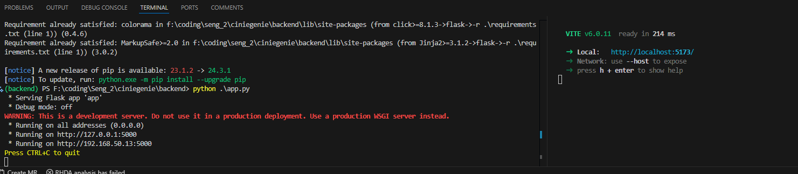

# Welcome to the absolute bare minimum of CinieGinie.
-> Install [Node.js](https://nodejs.org/en/download) <br />
-> Install [Python3.11](https://www.python.org/downloads/release/python-3114/) <br />


> Key notes:
1. You *might* have to re-create your own virtual environment when trying to work on the backend. An easy way to do it is by...
    - cd backend
    - *use python 3.11.x* 
    - python3 or python -m venv work
    - cd work
    - ./scripts/activate or source scripts/activate
    - cd ..
    - *make sure your env is activated it should say `(work) YourPath/ciniegenie/backend`
    - pip or pip3 install -r requirements.txt
    - python3 or python app.py
2. To run the frontend open up a new terminal from the root directory `ciniegenie`
    - cd frontend
    - npm install
    - npm install axios react-router-dom
    - npm run dev
3. If you followed everything and all is good then You're cooking!
    - If something is wrong dm Jason on teams.

> I do want to note we really shouldn't be working on coding for right now - we still have to do our personas and stuff but I figured I'd get the template stuff out the way.

* If everything works it will look like this:
    - 
    - 
* If backend doesn't work it will look like this:
    - 
* If frontend doesn't work... well there's no webpage


# Backend Model Creation

## 1. Setting Up Your Environment

**Create a Virtual Environment**

- **Command:**
  ```bash
  cd backend
  python -m venv work
  ```
- **Activation:**
  - **Windows:**
    ```bash
    .\work\Scripts\activate
    ```
  - **macOS/Linux:**
    ```bash
    source work/bin/activate
    ```

**Install Dependencies**

- **Packages:** pandas, numpy, scikit-learn, tensorflow, tensorflowjs.
- **Note:**tensorflowjs may have issues on Windows; consider alternatives like UNIX/LINUX if problems arise.
- **Command:**
  ```bash
  pip install -r requirements.txt
  ```

- You might need additional requirements like `ipykernel` or `jupyter-notebook`depending on your environment.

## 2. Data Prep

**Download IMDB Datasets**

- **Source:** Obtain from the IMDB [open datasets section]('https://developer.imdb.com/non-commercial-datasets/').
- Place these files in a `data` directory within your backend folder.

## 3. Data Processing

**Run Jupyter Notebook for Data Cleaning**

- **File:** `train_models.ipynb`
- **Objective:** Process raw data into cleaned a dataset.
- **Output Files:**
  - `processed_movies.csv`: Contains movie details like title, year, genre, etc.
  - `movies_with_genres.csv`: Includes additional genre information.
  - For more information, see [backend documentation](./backend/README.md)

## 4. Model Creation

**Train Neural Network**

- **File:** `create_NN.ipynb`
- **Objective:** Develop a neural network model to predict how much a user might like a movie.
- **Output:** Trained model saved as `improved_movie_rating_model.keras` in the `backend` directory.
  
    - Be sure to **Rename The Model File!!** `improved_movie_rating_model.keras` -> `basic_model.keras`

## 5. Convert Model to TensorFlow.js Format

**Run Conversion Script**

- **File:** `to_tfjs.py`
- **Objective:** Convert the Keras model into a format compatible with TensorFlow.js for use in frontend.
- **Output:**
  - New directory `tfjs_model` containing:
    - `model.json`
    - `group1-shard1of1.bin`

> **Manual Adjustment** is IMPORTANT!!

- **File to Edit:** `tfjs_model/model.json`
- **Change:** Replace `"batch_shape"` key with `"batch_input_shape"`.
- This has to do with some bug in the TFJS converter. 

## 6. Optional Steps for Frontend Updates

**To Update Title Data**

- **File:** `only_titles.ipynb`
- **Objective:** Extract and update movie titles used on the frontend.

**To Recreate Processed Movies Data**

- **File:** `recreate_processed_movies.ipynb`
- **Objective:** Generate updated processed movies data used in the frontend

## Deprecated Note

- **File:** `frontend_dataset.ipynb`
- No longer used; was used to upload files to firebase.